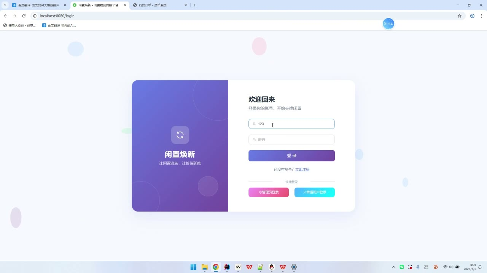
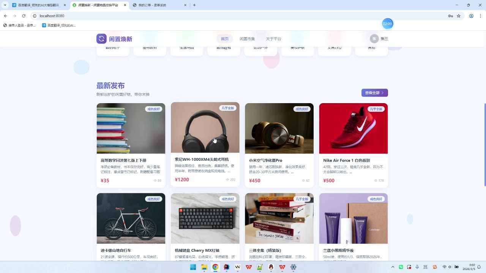
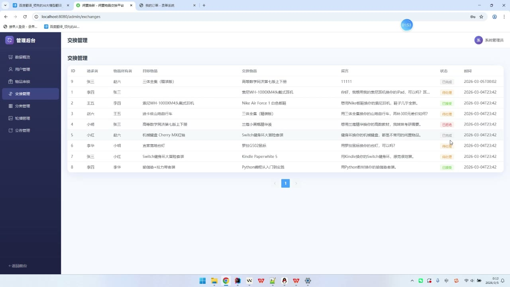
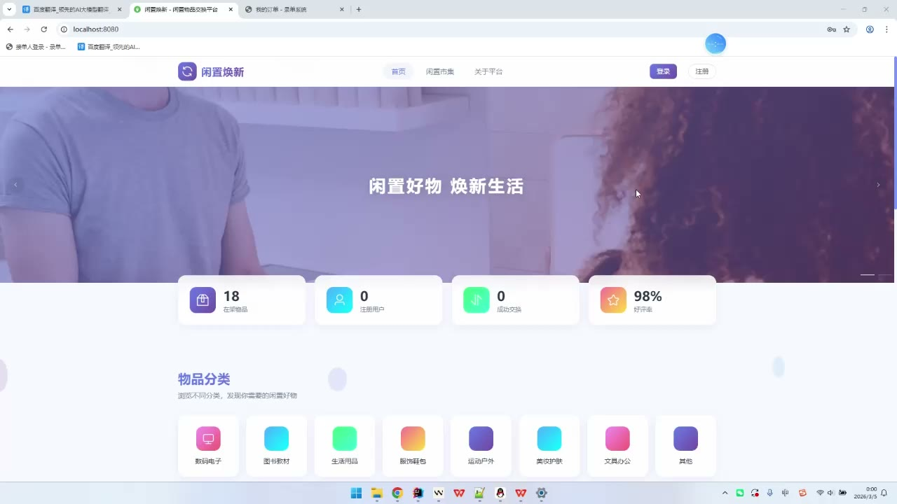
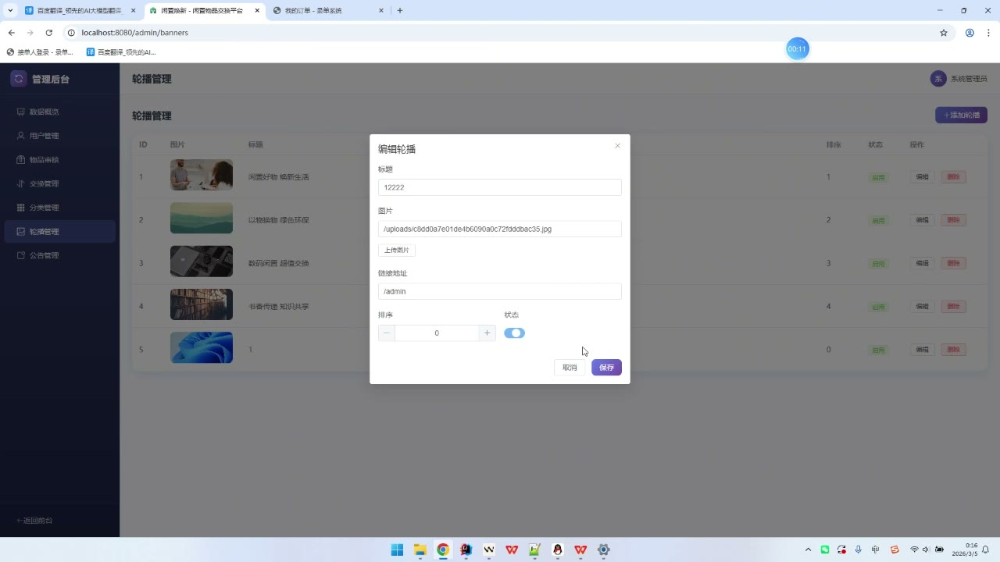

# (附文档)Springboot3+Vue3+MySQL 闲置物品交换系统

**技术栈**：Springboot3、Vue3、MySQL

### 系统简介

闲置物品交换系统是一套基于 SpringBoot3 + Vue3 + MySQL 的前后端分离平台，支持用户注册登录、闲置物品发布与管理、交换请求发起与处理、站内即时通讯、信用评价等完整功能。系统内置普通用户与管理员两种角色，普通用户可完成从发布物品到完成交换的全流程操作，管理员可对用户、物品、交换记录、轮播图、公告及分类进行统一管理。
 
### 核心功能
 
### 普通用户端

 
- 用户注册：填写用户名、昵称、密码完成账号注册，注册后默认角色为普通用户，初始信用分为100分。 
- 用户登录：支持用户名+密码登录，登录成功后颁发JWT令牌，用于后续接口鉴权。 
- 个人信息维护：修改昵称、手机号、邮箱、头像等个人资料。 
- 密码修改：输入原密码并验证通过后，可设置新密码。 
- 发布闲置物品：填写物品标题、描述、图片、价格、成色、期望交换物品等信息，发布后状态为待审核。 
- 我的物品列表：查看自己发布的全部物品，支持编辑、删除、下架操作。 
- 物品编辑：对已发布的物品信息进行修改更新。 
- 物品下架：将物品状态变更为已下架，不再对外展示。 
- 浏览公开物品：通过首页/物品列表页查看已审核通过的物品，支持关键词搜索、分类筛选。 
- 查看物品详情：查看物品完整信息，包括图片、描述、成色、期望交换内容、发布者信息，浏览数自动+1。 
- 发起交换请求：对心仪物品发起交换申请，填写留言并选择自己的物品作为交换物。 
- 我发出的交换请求：查看自己发起的交换请求列表，包含对方昵称、物品标题、状态。 
- 我收到的交换请求：查看他人对我物品发起的交换请求，可进行接受或拒绝操作。 
- 确认交换完成：对已接受的交换请求，双方均可确认完成，确认后双方物品状态变更为已交换。 
- 站内消息发送：向其他用户发送私信消息。 
- 聊天记录查看：查看与某一用户的完整聊天记录，进入会话后对方发来的消息自动标记为已读。 
- 会话列表：展示所有聊天会话，显示对方昵称、头像、最后一条消息内容、时间及未读条数。 
- 未读消息统计：实时获取当前用户的未读消息总数。 
- 发布评价：对交换对象进行评分（1-5星）并填写评价内容。 
- 查看他人评价：在物品详情页查看针对该用户的评价列表，包含评价人昵称、评分、内容。 
- 文件上传：支持上传物品图片、头像等文件，返回可访问的URL地址。
 
### 管理员端

 
- 仪表盘统计：查看平台用户总数、物品总数、交换请求总数、分类总数。 
- 用户管理：分页查看用户列表，支持按用户名/昵称关键词搜索，可启用或禁用用户账号。 
- 物品管理：分页查看所有物品，支持按关键词、状态筛选，可对物品进行审核通过/驳回操作，也可直接删除违规物品。 
- 交换记录查看：分页查看全部交换请求记录，了解平台交换动态。 
- 轮播图管理：查看轮播图列表，支持添加、编辑、删除轮播图，可设置标题、图片、链接、排序值、启用状态。 
- 公告管理：分页查看公告列表，支持添加、编辑、删除公告，可设置标题、内容、启用状态。 
- 分类管理：查看全部分类列表，支持添加、编辑、删除分类，可设置分类名称、图标、排序值。
 
### 技术栈

  后端框架 Spring Boot 3.x   ORM框架 MyBatis-Plus 3.5.x   权限认证 Spring Security + JWT（jjwt）   前端框架 Vue 3（Composition API + Script Setup）   前端UI组件库 Element Plus   状态管理 Pinia   前端路由 Vue Router 4（History模式）   构建工具 Vite   数据库 MySQL 8.x   密码加密 BCryptPasswordEncoder   文件上传 MultipartFile + 本地存储 
 
### 交付内容

 
- 后端完整源码 
- 前端完整源码 
- 数据库初始化脚本 
- 万字文档

## 界面展示

---

## 获取完整源码 + 万字文档

本仓库为项目介绍页。**完整前后端源码、数据库初始化脚本、万字项目文档**，请加微信 `kangkangcode`，或访问 [codekk.top](http://codekk.top) 获取。

可作课程设计 / 毕业设计参考，支持远程部署调试。